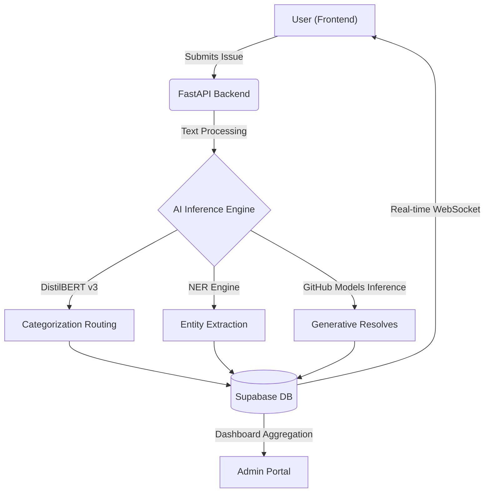

<div align="center">


<h1> Neural System Orchestrator </h1>


<br/>

[](https://opensource.org/licenses/MIT)
[](https://helpdeskaiv1.vercel.app/)

<br/>

  <a href="https://helpdeskaiv1.vercel.app/">
    
  </a>
  &nbsp;&nbsp;
  <a href="./MobileApp/application-2d277b36-4dbd-41c8-806d-cb2f19acf38a.apk">
    
  </a>
  &nbsp;&nbsp;
  <a href="https://helpdeskaiv1.vercel.app/contact-sales">
    
  </a>
  &nbsp;&nbsp;
  <a href="https://ritesh-1918.github.io/HELPDESK.AI/">
    
  </a>
  &nbsp;&nbsp;
  <a href="https://ritesh19180-ai-helpdesk-api.hf.space/docs">
    
  </a>

<br/><br/>
</div>

> [!NOTE] 
> ### Eliminating the Manual Triage Bottleneck
> Helpdesk.ai uses deep-learning neural networks and 4-layer enterprise architecture to categorize, prioritize, and resolve IT issues in milliseconds.

<br/>

<div align="center">

## 📖 Navigation Hub

| 🧩 **Platform Vision** | 🏗️ **Under the Hood** | 🚀 **Next Steps** |
| :--- | :--- | :--- |
| ➧ [Why Helpdesk.AI?](#why-helpdeskai)<br>➧ [The Enterprise Evolution](#the-enterprise-evolution) | ➧ [System Architecture](#system-architecture)<br>➧ [The AI Neural Pipeline](#the-ai-neural-pipeline) | ➧ [Deployment / Setup](#deploy)<br>➧ [Future Roadmap](#roadmap) |

</div>

<br/>

> [!IMPORTANT]
> <h2 id="why-helpdeskai">🎯 Why Helpdesk.AI?</h2>
> 
> Helpdesk.AI is more than just a ticketing tool; it is a **Neural Service Orchestrator** designed for modern enterprises. It provides massive ROI by:
> 
> 1.  **Eliminating the Triage Bottleneck**: By using context-aware AI (DistilBERT), it categorizes 100% of tickets in milliseconds, bypassing the L1 support line entirely.
> 2.  **Proactive Resolution**: Integrated LLMs (GitHub Models/Gemini) analyze issues during creation to suggest "Instant Fixes," severely reducing actual ticket volume.
> 3.  **Tiered Multi-Tenancy**: Built for true SaaS isolation, it securely isolates completely separate companies within a single Supabase database.

---

<h2 id="the-enterprise-evolution">💎 The Enterprise Evolution</h2>

Helpdesk.ai isn't just a ticketing tool; it's heavily engineered. Built to handle the complex requirements of modern organizations, it scales support without scaling headcount.

### 🏛️ 4-Layer Permission Matrix

| Layer | Audience | Primary Capabilities |
| :--- | :--- | :--- |
| **👑 Master Admin** | Global Overseers | Tenant Registration, Company Onboarding, Global Health Monitoring. |
| **🏢 Company Admin** | IT Management | Org-specific Dashboard, User Auditing, Sentiment Analytics. |
| **👤 Standard User** | Employees | AI-Powered Ticket Creation, Semantic Search, Real-time Status. |
| **🌐 Public Layer** | Prospects | Premium journey, Sales Engineering contact, Live Pricing tiers. |

---

<h2 id="system-architecture">🏗️ System Architecture</h2>

Helpdesk.ai utilizes a clean, decoupled architecture built for production operations.



---

<h2 id="the-ai-neural-pipeline">🧠 The AI Neural Pipeline</h2>

Under the hood, Helpdesk.ai leverages a custom suite of high speed models.

<table width="100%">
  <tr>
    <td width="50%" valign="top">
      <h3>1. High-Precision Classification</h3>
      <p>Driven by <b>DistilBERT v3</b>, our classifier understands technical context and user sentiment to assign accurate Impact Scores.</p>
      <h3>2. NER Metadata Harvesting</h3>
      <p>Automatically extracts vital technical identifiers without making the user fill out long dropdown forms:</p>
      <ul><li>Hostnames, Serial Numbers, IP Addresses.</li></ul>
    </td>
    <td width="50%" valign="top">
      <h3>3. Duplicate Prevention</h3>
      <p>If two users report the same outage, our <code>sentence-transformers</code> semantically link them to prevent "Ticket Flooding".</p>
      <h3>4. Generative OCR</h3>
      <p>Built-in screenshot analysis pulls error codes directly out of images. We process the images securely in milliseconds.</p>
    </td>
  </tr>
</table>

---

<h2 id="deploy">🚀 Deployment & Operations</h2>

Create a `.env` file in the `/Frontend` directory:
```bash
VITE_SUPABASE_URL=https://YOUR_PROJECT_REF.supabase.co
VITE_SUPABASE_ANON_KEY=your_key
VITE_STRIPE_GROWTH_LINK=your_stripe_link
VITE_BACKEND_URL=http://localhost:8000
```

### Local Installation
```bash
git clone https://github.com/ritesh-1918/HELPDESK.AI.git
cd HELPDESK.AI/Frontend
npm install
npm run dev
```

---

<h2 id="roadmap">🗺️ Roadmap</h2>

- [x] **Phase 1**: Core Ticketing & DistilBERT Categorization.
- [x] **Phase 2**: Multi-tenant SaaS Architecture (Supabase RLS).
- [x] **Phase 3**: GitHub Models integration for generative knowledge-base articles.
- [ ] **Phase 4**: SAP / ServiceNow direct bidirectional sync.
- [ ] **Phase 5**: AI Voice Support Agent via Twilio.

---

<h2 id="mobile-ecosystem">📱 Mobile Ecosystem (V1)</h2>

Helpdesk.ai is now available as a native Android application. It features a complete mobile-first experience for employees and admins.

- **Real-time Status Tracking**: Instant updates on ticket progress with custom in-app notifications.
- **Biometric Ready**: Secure access with enterprise-grade authentication.
- **Smart Onboarding**: Dynamic routing for new users and pending registrations.
- **Session Replay**: Integrated with **LogRocket** for proactive debugging and user support.

[**📥 Download HelpDesk.ai V1 APK**](./MobileApp/application-2d277b36-4dbd-41c8-806d-cb2f19acf38a.apk)

---

<div align="center">
Built with <span style="color:#10b981;">💚</span> by the <strong>HELPDESK.AI Professional</strong> Team. 
</div>
