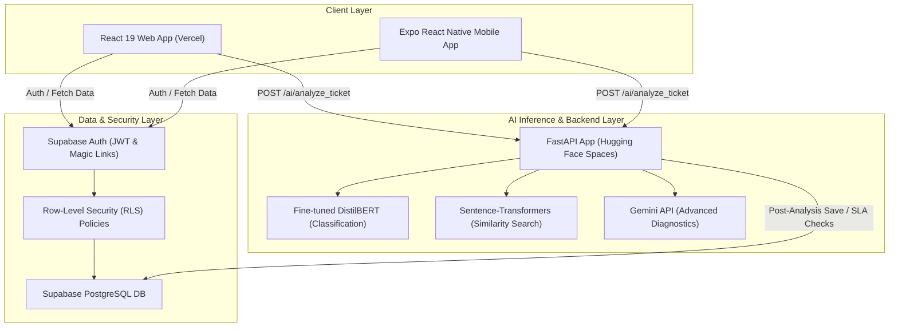

# Helpdesk.ai — Project Handoff Sheet: 01. Project Overview & Architecture

Welcome to the handoff sheet for **Helpdesk.ai**. This document outlines the overall project ecosystem, repositories, links, platforms, and primary system architecture to enable a seamless transition to Claude Code.

---

## 🚀 1. Platform Infrastructure & Deployments

Helpdesk.ai is built on a highly-decoupled, modern SaaS architecture consisting of a web front-end, a cross-platform mobile app, a containerized Python FastAPI AI microservice, and a Supabase backend database layer.

| Platform Component | Technical Stack | Deployment URL / URI | Details & Purpose |
| :--- | :--- | :--- | :--- |
| **GitHub Repository** | Git Version Control | `github.com/ritesh-1918/HELPDESK.AI` | Source of truth. Main branch is `main`. |
| **Frontend (Web)** | React 19 + Vite + TailwindCSS | [helpdeskaiv1.vercel.app](https://helpdeskaiv1.vercel.app) | Enterprise B2B SaaS web portal (Vercel deployment) |
| **Mobile App** | React Native (Expo SDK 54) | [EAS App Dashboard](https://expo.dev/accounts/ritesh1918/projects/helpdesk-ai) | Android and iOS applications managed via EAS |
| **Backend (AI API)** | Python FastAPI | [ritesh19180-ai-helpdesk-api.hf.space](https://ritesh19180-ai-helpdesk-api.hf.space) | Machine learning pipeline deployed on Hugging Face Spaces |
| **Database & Auth** | Supabase (PostgreSQL) | [aejuenhqciagpntcqoir.supabase.co](https://supabase.com) | Database engine, authentication, and RLS policies |
| **EAS/Expo Account** | Expo CLI | Owner: `ritesh1918` | Credentials and remote EAS builds for APK/AAB |

---

## 📐 2. High-Level Architecture Diagram

---

## 👥 3. Multi-Tenant Role-Based Access Control (RBAC)

The platform is designed as a multi-tenant B2B SaaS system, partitioned by `company_id`. RLS rules protect cross-tenant data.

1. **`user` (Standard Employees):**
   - Can submit tickets through AI Understanding pipeline.
   - Can view only their own ticket queue and comment history.
   - Access to self-service knowledge base.

2. **`admin` (Company IT Administrators):**
   - Manage all users and tickets within their specific `company_id`.
   - Access to performance analytics dashboards and HSL custom settings.
   - Actionable SLA escalations, manual classification overrides, and vendor assignments.
   - *Example Admin account:* Admin access to company settings is mapped via a specific corporate domain or designated email (e.g. `admin@company.com`).

3. **`master_admin` (Platform Operator):**
   - Global control panel for company onboarding, platform usage metrics, and subscription tiers.
   - View system-wide bug reports and diagnostic health charts.

---

## 📊 4. Core Features Implemented

- **Text Classification Pipeline:** Automatic categorisation of incoming tickets into departments (IT, HR, Billing, Facilities) using fine-tuned `DistilBERT`.
- **Semantic Duplicate Detection:** Submissions are analyzed using `sentence-transformers/all-MiniLM-L6-v2` to score similarity with existing company tickets and flag parent ticket merges.
- **Named Entity Recognition (NER):** Automatic extraction of systems, error codes, emails, and dates from raw inputs.
- **EasyOCR Integration:** Users can snap screenshot errors, which are automatically parsed via OCR and merged into the ticket description.
- **Gemini Troubleshooting Hub:** Custom AI chatbot dynamically guides users through troubleshooting steps before ticket creation to reduce helpdesk load.
- **Automatic SLA Escalation:** SLA breach tracking engine that runs automatically and flags expiring/overdue tickets.
